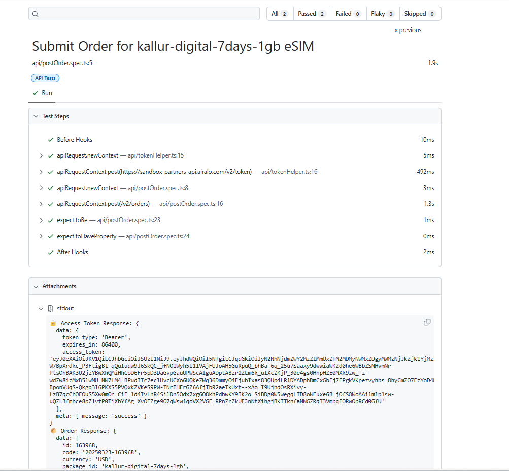
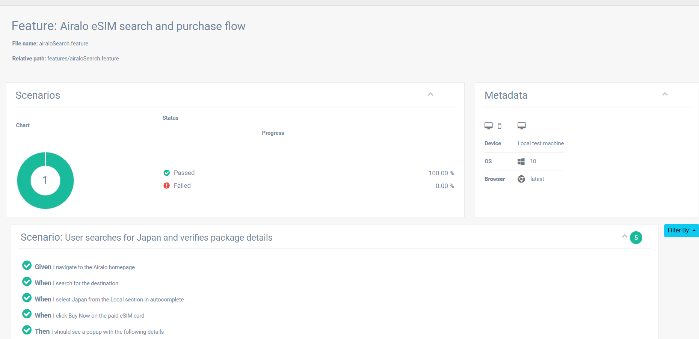

# Install Dependencies
npm install

# Install Playwright Browsers
npx playwright install

# Create a .env file
BASE_URL=https://your-api-url.com
CLIENT_ID=your-client-id
CLIENT_SECRET=your-client-secret

# To run API tests
npm run test:api          # Run only API tests
npm run test:api:report   # Run API tests with HTML report

# To ru nUI tests
npm run test:ui           # Run only UI tests
npm run test:ui:report    # Run UI tests with Extent Report

# To generate a report
node generateReport.js

# To open a report
start ./reports/html/index.html

